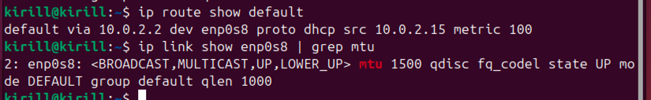

### Задание 1

- ___Продемонстрировать версию ядра вашей ОС___

Команда: ``uname -r``


- ___Показать все загруженные модули ядра___

Команда: ``lsmod``
```
kirill@kirill:~/Desktop$ lsmod
Module                  Size  Used by
isofs                  57344  1
snd_seq_dummy          12288  0
snd_hrtimer            12288  1
qrtr                   49152  2
cfg80211             1249280  0
binfmt_misc            28672  1
nls_iso8859_1          12288  1
snd_hda_codec_idt      69632  1
snd_hda_codec_generic   114688  1 snd_hda_codec_idt
snd_hda_intel          57344  3
snd_intel_dspcfg       20480  1 snd_hda_intel
snd_hda_codec         208896  3 snd_hda_codec_generic,snd_hda_intel,snd_hda_codec_idt
snd_hda_core          163840  4 snd_hda_codec_generic,snd_hda_intel,snd_hda_codec,snd_hda_codec_idt
snd_hwdep              24576  1 snd_hda_codec
snd_pcm               196608  4 snd_hda_intel,snd_hda_codec,snd_hda_core
snd_seq_midi           24576  0
snd_seq_midi_event     20480  1 snd_seq_midi
snd_rawmidi            53248  1 snd_seq_midi
snd_seq               126976  9 snd_seq_midi,snd_seq_midi_event,snd_seq_dummy
gpio_keys              24576  0
snd_seq_device         16384  3 snd_seq,snd_seq_midi,snd_rawmidi
vmwgfx                446464  2
snd_timer              53248  3 snd_seq,snd_hrtimer,snd_pcm
snd                   147456  17 snd_hda_codec_generic,snd_seq,snd_seq_device,snd_hwdep,snd_hda_intel,snd_hda_codec,snd_timer,snd_pcm,snd_hda_codec_idt,snd_rawmidi
drm_ttm_helper         12288  1 vmwgfx
soundcore              16384  1 snd
ttm                   106496  2 vmwgfx,drm_ttm_helper
vboxguest             507904  4
soc_button_array       16384  0
input_leds             12288  0
joydev                 36864  0
sch_fq_codel           24576  2
dm_multipath           49152  0
efi_pstore             12288  0
nfnetlink              20480  1
ip_tables              36864  0
x_tables               65536  1 ip_tables
autofs4                57344  2
btrfs                1929216  0
blake2b_generic        24576  0
raid10                 77824  0
raid456               212992  0
async_raid6_recov      24576  1 raid456
async_memcpy           16384  2 raid456,async_raid6_recov
async_pq               16384  2 raid456,async_raid6_recov
async_xor              16384  3 async_pq,raid456,async_raid6_recov
async_tx               16384  5 async_pq,async_memcpy,async_xor,raid456,async_raid6_recov
xor                    12288  2 async_xor,btrfs
xor_neon               16384  1 xor
raid6_pq              110592  4 async_pq,btrfs,raid456,async_raid6_recov
libcrc32c              12288  2 btrfs,raid456
raid1                  61440  0
raid0                  24576  0
hid_generic            12288  0
usbhid                 81920  0
hid                   184320  2 usbhid,hid_generic
crct10dif_ce           12288  1
polyval_ce             12288  0
polyval_generic        12288  1 polyval_ce
ghash_ce               24576  0
e1000                 221184  0
sm4                    12288  0
sha3_ce                16384  0
sha2_ce                20480  0
sha256_arm64           24576  1 sha2_ce
xhci_pci               28672  0
sha1_ce                12288  0
xhci_pci_renesas       24576  1 xhci_pci
aes_neon_bs            24576  0
aes_neon_blk           28672  1 aes_neon_bs
aes_ce_blk             36864  0
aes_ce_cipher          12288  1 aes_ce_blk
```

- ___Отключить автозагрузку модуля cdrom___

Создадим файл конфигурации: ``sudo nano /etc/modprobe.d/blacklist-cdrom.conf``

В созданный файл добавим следующие строки: 
```
blacklist cdrom
install cdrom /bin/false
```

Тем самым мы запрещаем автозагрузку модуля, и когда initramfs будет загружаться сразу после ядра - при попытке 
подгрузить cdrom будет выполняться /bin/false, который завершится ошибкой

После этого необходимо обновить initramfs, чтобы запрет вступил в силу:
``sudo update-initramfs -u``

После чего перезагрузим систему:
``sudo reboot``

После перезагрузки системы проверим, что модуль не загружается автоматически:
``lsmod | grep cdrom``


- ___Найти и описать конфигурацию ядра (файл конфигурации, параметр CONFIG_XFS_FS).___

Для вывода информации используем команду: ``grep CONFIG_XFS_FS /boot/config-6.8.0-84-generic``


Значение ``m`` означает, что поддержка файловой системы XFS собрана не как часть ядра, а как отдельный загружаемый модуль.

Такой подход позволяет уменьшить размер базового ядра и загружать поддержку XFS только при ее использовании.

### Задание 2

- ___Используйте strace для анализа команды cat /etc/os-release > /dev/null___

Команда: ``strace -e trace=openat,read,write,close cat /etc/os-release > /dev/null``

```
kirill@kirill:~$ strace -e trace=openat,read,write,close cat /etc/os-release > /dev/null
openat(AT_FDCWD, "/etc/ld.so.cache", O_RDONLY|O_CLOEXEC) = 3
close(3)                                = 0
openat(AT_FDCWD, "/lib/aarch64-linux-gnu/libc.so.6", O_RDONLY|O_CLOEXEC) = 3
read(3, "\177ELF\2\1\1\3\0\0\0\0\0\0\0\0\3\0\267\0\1\0\0\0\360\206\2\0\0\0\0\0"..., 832) = 832
close(3)                                = 0
openat(AT_FDCWD, "/usr/lib/locale/locale-archive", O_RDONLY|O_CLOEXEC) = 3
close(3)                                = 0
openat(AT_FDCWD, "/etc/os-release", O_RDONLY) = 3
read(3, "PRETTY_NAME=\"Ubuntu 24.04.3 LTS\""..., 131072) = 400
write(1, "PRETTY_NAME=\"Ubuntu 24.04.3 LTS\""..., 400) = 400
read(3, "", 131072)                     = 0
close(3)                                = 0
close(1)                                = 0
close(2)                                = 0
+++ exited with 0 +++
```

Данный вывод показывает последовательность системных вызовов, которые происходят при выполнении 
команды ``cat /etc/os-release > /dev/null``, с отслеживанием только операций открытия, чтения, записи и закрытия файлов.

``/etc/ld.so.cache`` - файл кэша динамических библиотек

``/lib/aarch64-linux-gnu/libc.so.6`` - основная системная библиотека libc

``/usr/lib/locale/locale-archive`` - архив локалей для системы

``/etc/os-release`` - конфигурационный файл с данными о версии и названии ОС

``write`` отражает запись в stdout, поскольку ``cat`` не знает о том, что данные никуда не попадут, так что просто вызывает ``write``.

Но так как вывод перенаправлен в ``/dev/null`` - специальное устройство, уничтожающее все, что в него записывается, 
то данные никуда не сохранятся, по сути просто потеряются.

### Задание 3

- ___Добавить к своей виртуальной машине диск /dev/sdb размером 2GB___


- ___Создать раздел на /dev/sdb, используя fdisk или parted___

Добавляем раздел при помощи команды `sudo fdisk /dev/sdb`

В ``fdisk`` нажимаем ``n`` и оставляем все настройки по дефолту, после чего нажатием на ``w`` сохраняем изменения и выходим

Проверяем результат:


- ___Создать Physical Volume (PV) на этом разделе___

Команда: ``sudo pvcreate /dev/sdb1``


- ___Создать Volume Group (VG) с именем vg_highload___

Команда: ``sudo vgcreate vg_highload /dev/sdb1``


- ___Создать два Logical Volume (LV): data_lv (1200 MiB) и logs_lv (оставшееся место)___

Команды:
```
sudo lvcreate -L 1200M -n data_lv vg_highload
sudo lvcreate -l 100%FREE -n logs_lv vg_highload
```


- ___Отформатировать data_lv как ext4 и примонтировать в /mnt/app_data___

Команды:
```
sudo mkfs.ext4 /dev/vg_highload/data_lv
sudo mkdir -p /mnt/app_data /mnt/app_logs
sudo mount /dev/vg_highload/data_lv /mnt/app_data
```


- ___Отформатировать logs_lv как xfs и примонтировать в /mnt/app_logs___

Команды:
```
sudo mkfs.xfs /dev/vg_highload/logs_lv
sudo mount /dev/vg_highload/logs_lv /mnt/app_logs
```


Проверка успешного выполнения заданий:


### Задание 4

- ___Извлечь из /proc модель CPU и объем памяти (KiB)___

Модель CPU:

Команда: ``grep "model name" /proc/cpuinfo``


Модель CPU не удается достать. При открытии ``/proc/cpuinfo`` можно увидеть, что модели CPU действительно в нем не указано:


Это связано с тем, что у меня ARM-процессор, для них она не всегда указана.

Объем памяти:

Команда: ``grep MemTotal /proc/meminfo``


- ___Используя /proc/$$/status, найдите Parent Process ID (PPid) вашего текущего shell. Что означает $$?___

Команда: ``grep PPid /proc/$$/status``


``$$`` означает PID текущего процесса оболочки, в котором выполняется команда

- ___Определить настройки I/O scheduler для основного диска /dev/sda___

Команда: ``cat /sys/block/sda/queue/scheduler``


Вывод отражает, что для устройства ``/dev/sda`` доступно два варианта планировщика ввода-вывода ``none`` и ``mq-deadline``

``none`` выделен в квадратные скобки - значит он выбран по умолчанию. Это планировщик, который не выполняет перестановки
запросов и практически не добавляет накладных расходов.

Второй вариант — ``mq-deadline``. Это более сложный планировщик, использующий дедлайны для упорядочивания операций 
ввода-вывода, что обеспечивает более предсказуемую производительность.

- ___Определить размер MTU для основного сетевого интерфейса (например, eth0 или ens33)___

Команды:
```
ip route show default
ip link show enp0s8 | grep mtu
```

Сначала определяем основной сетевой интерфейс, после чего определяем размер MTU для него



Значение MTU - 1500 байт, это максимальный размер сетевого пакета