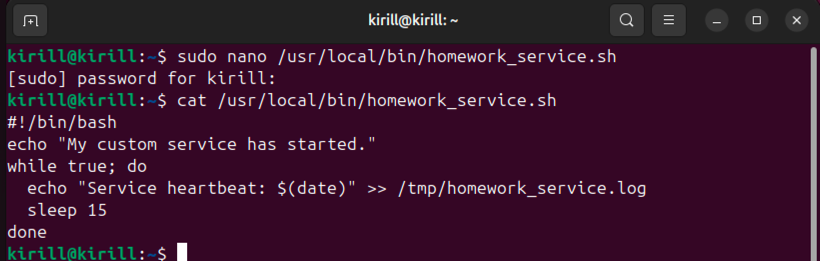
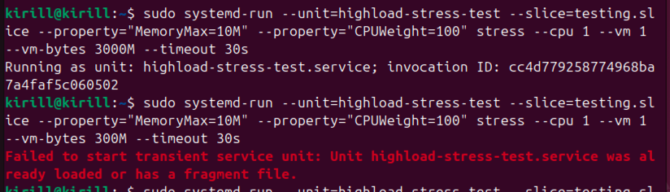

### Задание 1

- ___Создайте bash-скрипт /usr/local/bin/homework_service.sh___

Сделаем скрипт исполняемым: ``sudo chmod +x /usr/local/bin/homework_service.sh``

- ___Создайте systemd unit файл для скрипта, который бы переживал любые обновления системы. Убедитесь, что сервис сам 
перезапускается в случае падения через 15 секунд___

Перезагрузим конфигурацию systemd: ``sudo systemctl daemon-reload``

- ___Запустите сервис и убедитесь, что он работает___

Запустим сервис: ``sudo systemctl start homework.service``

Включим автозапуск: ``sudo systemctl enable homework.service``

Убедимся, что сервис работает: ``sudo systemctl status homework.service``

- ___Используя systemd-analyze, покажите топ-5 systemd unit'ов стартующих дольше всего.___

Команда: ``systemd-analyze blame | head -5``

Во всем списке (не только топ-5) моего сервиса нет, хотя автозагрузка включена, и система была перезагружена:

Вероятно, это связано с тем, что время старта сервиса слишком мало

### Задание 2

- ___Создайте шареную память___

- ___Скомпилируйте и запустите___

- ___Пока программа запущена (60 секунд), проанализируйте вывод: в соседнем терминале запустите ipcs -m. Обратите 
внимание на nattch (number of attached processes) проанализируйте вывод___

При повторном запуске изменился параметр ``shmid``, он отображает идентификатор сегмента. Этот параметр продолжает 
увеличиваться при повторных запусках программы, поскольку после удаления сегмента номер счетчика не сбрасывается, а при
перезапуске выдается следующий номер

При перезапуске системы и запуске программы ``shmid`` будет снова 0:

``nnatch`` - отображает кол-во процессов, которые в данный момент прикреплены к разделяемой памяти. В программе 
отсутствует вызов ``shmat``, который присоединяет сегмент к адресному пространству процесса, и сам сегмент не 
открывается для чтения/записи, так что ``nattch = 0``

Если добавить в программу строчку ``shmat(shmid, NULL, 0);`` (т.е. присоединить сегмент к адресному пространству 
процесса), то ``nattch = 1``:

### Задание 3

- ___Откройте 1 окно терминала и запустите питон скрипт, который запрашивает 250 MiB памяти и держит ее 2 минуты___

- ___Пока скрипт запущен, откройте вторую вкладку, найдите там PID запущенного скрипта и проанализируйте использование 
RSS___

Поиск PID'а: ``ps aux | grep 'python3 -c'``

- ___Объясните почему vsz больше rss, и почему rss далеко не 0___

``VSZ`` - виртуальный размер - показывает все адресное пространство

``RSS`` - показывает реально загруженные в физическую память страницы

Соответственно ``VSZ`` > ``RSS``

``RSS`` не равен нулю, т.к. скриптом действительно была выделена

### Задание 4

- ___Продемонстрируйте количество NUMA нод на вашем сервере и количество памяти для каждой NUMA ноды___

Команда: ``numactl --hardware``

- ___Убедитесь что вы можете ограничивать работу процессов при помощи systemd___

- ___Будет ли работать тест если мы запрашиваем 300M оперативной памяти, а ограничиваем 150M? В соседней вкладке 
проследите за testing.slice при помощи systemd-cgls. Превысило ли использование памяти 150M? Что происходит с процессом 
при превышении? Попробуйте использовать разные значения___

Тест работает в рамках ограниченного кол-ва памяти. Если ``MemoryMax`` ≤ ``--vm-bytes``, то память используется по 
максимуму в пределах заданного ``MemoryMax``, иначе - память потребляется в рамках диапазона [0, --vm-bytes].

Если приложение потребляет больше выделенной памяти, то тест завершается, в моем случае этого удалось достигнуть, 
например, когда ``MemoryMax = 10M``, а ``--vm-bytes = 3000M``. После такого падения не удалось заново запустить тест:

Для слежения за потребляемой памятью использовал команду: ``systemd-cgtop``

- ___Опишите что делает и для чего можно использовать MemoryMax and CPUWeight___

``MemoryMax`` - это ограничение на максимальное количество оперативной памяти, доступной процессам внутри заданной 
cgroup. Позволяет предотвращать ситуации, когда один сервис или группа процессов съедает всю память и влияет на 
стабильность всей системы. Если суммарное потребление памяти процессами cgroup превышает этот лимит, то система применяет Out-Of-Memory, 
что приводит к аварийному завершению процессов, которые потребляют слишком много памяти.

``CPUWeight`` - Определяет относительный вес (приоритет) в распределении времени процессора между cgroup. Чем выше 
значение (диапазон от 1 до 10000), тем большую часть CPU выделят данной cgroup при конкурентном использовании между 
несколькими cgroup. 
