### Задание 1

- ___Запустите Python HTTP сервер на порту 8080___

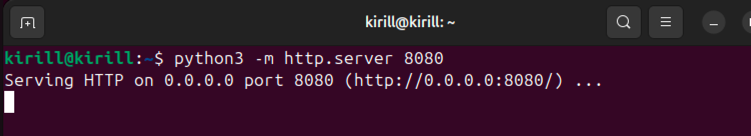

- ___Проверяйте слушающие TCP-сокеты с помощью утилиты ss. найдите сокет с вашим http сервером___

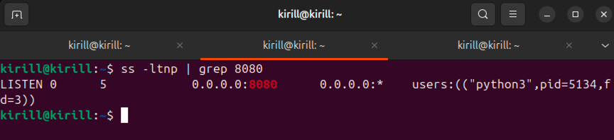

- ___Подключитесь к серверу через curl___

Команда и вывод:
```
kirill@kirill:~$ curl http://localhost:8080
<!DOCTYPE HTML>
<html lang="en">
<head>
<meta charset="utf-8">
<title>Directory listing for /</title>
</head>
<body>
<h1>Directory listing for /</h1>
<hr>
<ul>
<li><a href=".bash_history">.bash_history</a></li>
<li><a href=".bash_logout">.bash_logout</a></li>
<li><a href=".bashrc">.bashrc</a></li>
<li><a href=".cache/">.cache/</a></li>
<li><a href=".config/">.config/</a></li>
<li><a href=".lesshst">.lesshst</a></li>
<li><a href=".local/">.local/</a></li>
<li><a href=".profile">.profile</a></li>
<li><a href=".ssh/">.ssh/</a></li>
<li><a href=".sudo_as_admin_successful">.sudo_as_admin_successful</a></li>
<li><a href=".vboxclient-clipboard-tty2-control.pid">.vboxclient-clipboard-tty2-control.pid</a></li>
<li><a href=".vboxclient-clipboard-tty2-service.pid">.vboxclient-clipboard-tty2-service.pid</a></li>
<li><a href=".vboxclient-draganddrop-tty2-control.pid">.vboxclient-draganddrop-tty2-control.pid</a></li>
<li><a href=".vboxclient-hostversion-tty2-control.pid">.vboxclient-hostversion-tty2-control.pid</a></li>
<li><a href=".vboxclient-seamless-tty2-control.pid">.vboxclient-seamless-tty2-control.pid</a></li>
<li><a href=".vboxclient-vmsvga-session-tty2-control.pid">.vboxclient-vmsvga-session-tty2-control.pid</a></li>
<li><a href=".vboxclient-vmsvga-session-tty2-service.pid">.vboxclient-vmsvga-session-tty2-service.pid</a></li>
<li><a href="Desktop/">Desktop/</a></li>
<li><a href="Documents/">Documents/</a></li>
<li><a href="Downloads/">Downloads/</a></li>
<li><a href="Music/">Music/</a></li>
<li><a href="Pictures/">Pictures/</a></li>
<li><a href="Public/">Public/</a></li>
<li><a href="shm_creator">shm_creator</a></li>
<li><a href="shm_creator.c">shm_creator.c</a></li>
<li><a href="Templates/">Templates/</a></li>
<li><a href="Videos/">Videos/</a></li>
</ul>
<hr>
</body>
</html>
```

- ___Проанализируйте состояние TCP-сокетов для порта 8080, объясните, почему есть сокет в состоянии TIME-WAIT, 
его роль и почему его нельзя удалить___

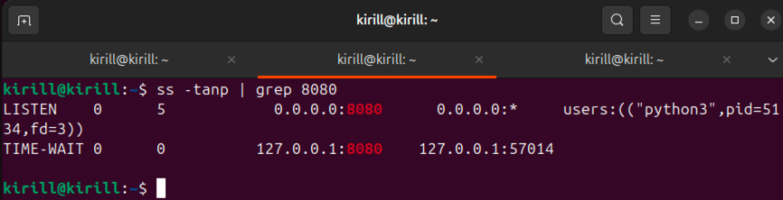

``TIME-WAIT`` означает, что сокет ждёт окончания времени, чтобы убедиться, что все пакеты завершённого соединения 
ушли из сети. Это нужно, чтобы избежать путаницы с новыми соединениями, использующими те же порты

Нельзя удалить сокеты в TIME-WAIT поскольку это часть механизма корректного завершения TCP-соединений согласно протоколу,
это может привести к потере данных или нестабильности сети

- ___Опишите, к каким проблемам может привести большое количество TIME-WAIT сокетов___

Могут возникнуть следующие проблемы:
- Исчерпание доступных портов - каждый TCP-сокет в TIME-WAIT занимает локальный порт, и если соединений много, то можно
быстро достичь лимита доступных исходящих портов. Это приведёт к ошибкам при попытке установить новые соединения 
- Высокая нагрузка на ресурсы системы - множество TIME-WAIT сокетов занимают память и файловые дескрипторы, что может 
негативно сказаться на производительности системы и привести к исчерпанию системных ресурсов 
- Задержки при установлении новых соединений - из-за занятости портов и ожидания завершения старых соединений могут 
возникать задержки в работе сетевого приложения, снижаться общая пропускная способность 
- Потенциальные сложности с масштабируемостью - в высоконагруженных системах большое количество TIME-WAIT соединений 
может создавать препятствия для масштабирования и устойчивости приложений 

### Задание 2

- ___Создайте dummy-интерфейс с адресом 192.168.14.88/32, назовите его service_0___

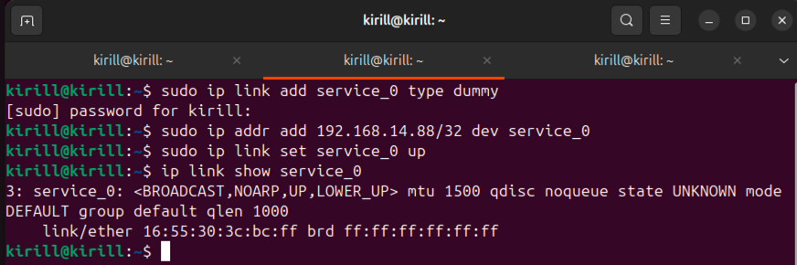

- ___При помощи BIRD проаннонсируйте этот адрес при помощи протокола RIP v2 включенного на вашем интерфейсе 
(eth0/ens33), а так же любой другой будущий адрес из подсети 192.168.14.0/24 но только если у него будет маска 
подсети /32 и имя будет начинаться на service___

Добавим конфигурацию в ``/etc/bird.conf``:
```
router id 192.168.14.88;

protocol kernel {
  persist;
  scan time 10;
  import all;
  export filter rip_export;
}

protocol device {
  scan time 10;
}

protocol direct {
  interface "*";
}

filter rip_export {
  if netmask_length = 32 and (interface ~ "^service_.*") then accept;
  reject;
}

protocol rip rip1 {
  version 2;
  import all;
  export filter rip_export;
}
```

Интерфейс указан `enp0s8` поскольку он является у меня дефолтным:
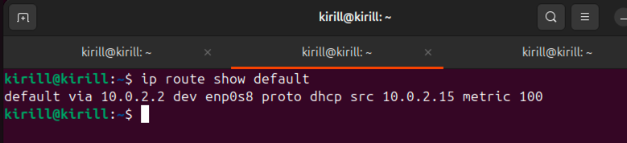

- ___Создайте ещё три интерфейса___

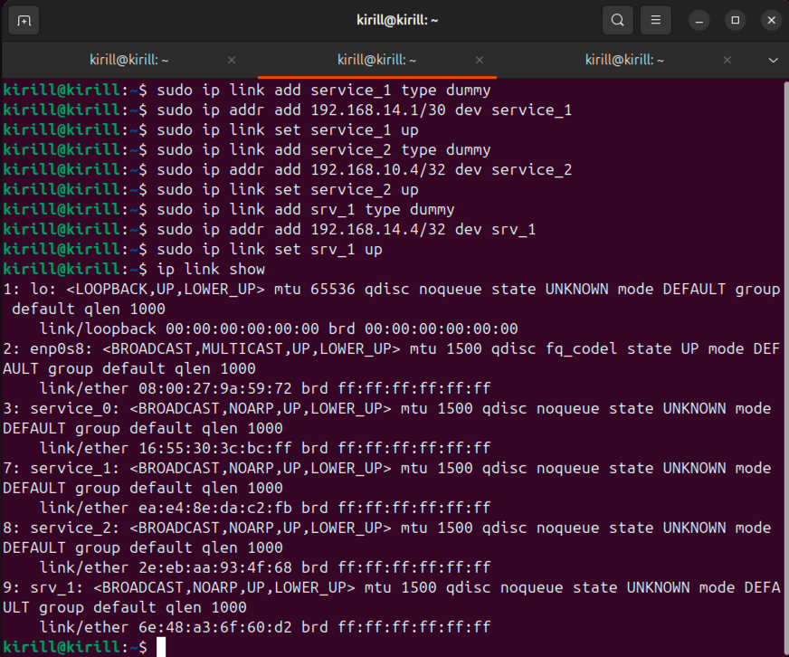

- ___С помощью tcpdump докажите, что анонсируются только нужные адреса, без лишних___

К сожалению, не удалось добиться того, чтобы пакеты летели по нужному порту

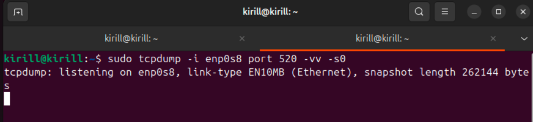

Вероятно это связано с тем, что ``bird.conf`` написан не совсем корректно:

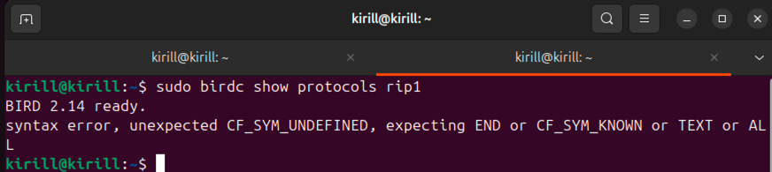

Но исправить файл так, чтобы данная ошибка ушла - не получилось

### Задание 3

- ___С помощью iptables или nftables создайте правило, запрещающее подключения к порту 8080___

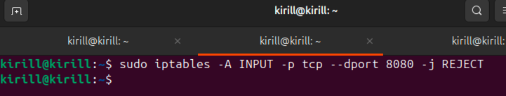

- ___Запустите веб сервер на питоне и продемонстрируйте работу вашего firewall при помощи tcpdump___

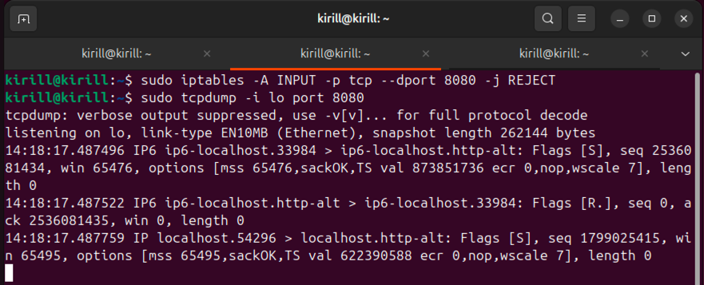

Строка с флагом ``[S]`` означает SYN - попытка установить новое TCP-соединение.

Строка с флагом ``[R]`` означает TCP RST (reset), то есть сброс соединения фаерволом

Сама попытка подключения также выдает ошибку:

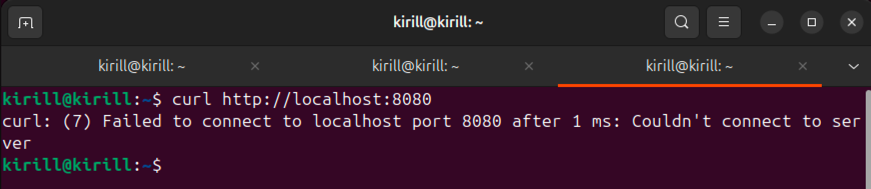

### Задание 4

- ___С помощью ethtool исследуйте offload возможности вашего сетевого адаптера___

```
kirill@kirill:~$ sudo ethtool -k enp0s8
Features for enp0s8:
rx-checksumming: off
tx-checksumming: on
	tx-checksum-ipv4: off [fixed]
	tx-checksum-ip-generic: on
	tx-checksum-ipv6: off [fixed]
	tx-checksum-fcoe-crc: off [fixed]
	tx-checksum-sctp: off [fixed]
scatter-gather: on
	tx-scatter-gather: on
	tx-scatter-gather-fraglist: off [fixed]
tcp-segmentation-offload: on
	tx-tcp-segmentation: on
	tx-tcp-ecn-segmentation: off [fixed]
	tx-tcp-mangleid-segmentation: off
	tx-tcp6-segmentation: off [fixed]
generic-segmentation-offload: on
generic-receive-offload: on
large-receive-offload: off [fixed]
rx-vlan-offload: on
tx-vlan-offload: on [fixed]
ntuple-filters: off [fixed]
receive-hashing: off [fixed]
highdma: off [fixed]
rx-vlan-filter: on [fixed]
vlan-challenged: off [fixed]
tx-lockless: off [fixed]
netns-local: off [fixed]
tx-gso-robust: off [fixed]
tx-fcoe-segmentation: off [fixed]
tx-gre-segmentation: off [fixed]
tx-gre-csum-segmentation: off [fixed]
tx-ipxip4-segmentation: off [fixed]
tx-ipxip6-segmentation: off [fixed]
tx-udp_tnl-segmentation: off [fixed]
tx-udp_tnl-csum-segmentation: off [fixed]
tx-gso-partial: off [fixed]
tx-tunnel-remcsum-segmentation: off [fixed]
tx-sctp-segmentation: off [fixed]
tx-esp-segmentation: off [fixed]
tx-udp-segmentation: off [fixed]
tx-gso-list: off [fixed]
fcoe-mtu: off [fixed]
tx-nocache-copy: off
loopback: off [fixed]
rx-fcs: off
rx-all: off
tx-vlan-stag-hw-insert: off [fixed]
rx-vlan-stag-hw-parse: off [fixed]
rx-vlan-stag-filter: off [fixed]
l2-fwd-offload: off [fixed]
hw-tc-offload: off [fixed]
esp-hw-offload: off [fixed]
esp-tx-csum-hw-offload: off [fixed]
rx-udp_tunnel-port-offload: off [fixed]
tls-hw-tx-offload: off [fixed]
tls-hw-rx-offload: off [fixed]
rx-gro-hw: off [fixed]
tls-hw-record: off [fixed]
rx-gro-list: off
macsec-hw-offload: off [fixed]
rx-udp-gro-forwarding: off
hsr-tag-ins-offload: off [fixed]
hsr-tag-rm-offload: off [fixed]
hsr-fwd-offload: off [fixed]
hsr-dup-offload: off [fixed]

```

- ___Покажите включён ли TCP segmentation offload___

Да, включен:

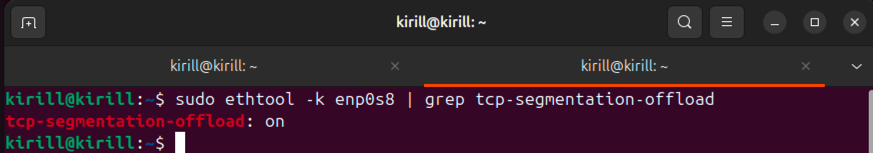

- ___Объясните, какую задачу решает TCP segmentation offload___

Он позволяет сетевой карте самостоятельно разделять большие TCP-сегменты на меньшие, уменьшая нагрузку на 
процессор и повышая производительность сетевого стека.

То есть драйвер сетевой карты принимает большие TCP-пакеты от ОС и уже на уровне сетевой карты разбивает их на сегменты.
Это значительно снижает нагрузку на ЦП, поскольку тяжелая работа сегментации переносится на специализированное 
оборудование сетевой карты. В итоге, производительность сети и общей системы улучшается за счет разгрузки ЦП от затрат 
по сегментации TCP-пакетов.