### Задание 1
Создайте у себя в home dir 2 папки ~/backend1 и ~/backend2, в каждой из которых должен лежать 1 index.html

&lt;h1&gt;Response from Backend Server 1&lt;/h1&gt;

&lt;h2&gt;*** Response from Backend Server 2 ***&lt;/h2&gt;

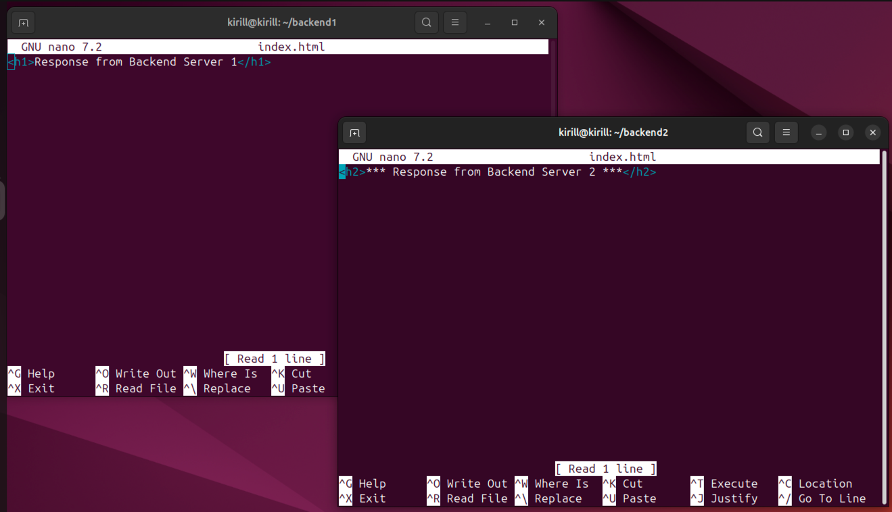

- ___Внутри этих папок запустите питоновый http сервер на портах 8081 и 8082 соответсвенно___

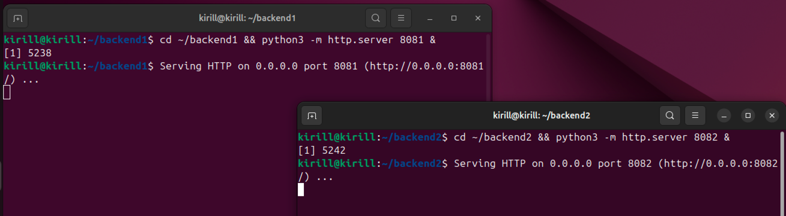

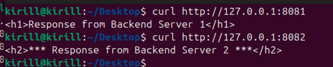

### Задание 2.
- __При помощи dnsmasq создайте 2 A записи__

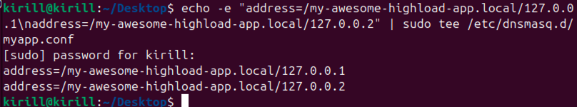

- ___Запустите dnsmasq и при помощи dig обратитесь к 127.0.0.1 для резолва my-awesome-highload-app.local___

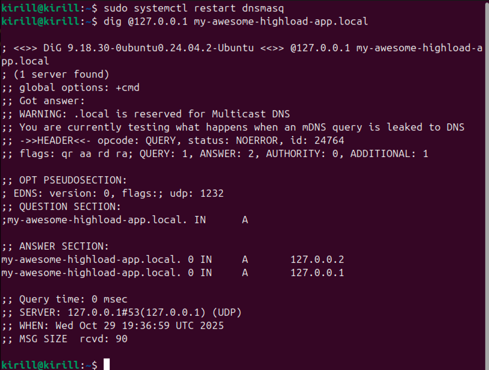

- ___Проанализируйте вывод, что произойдет с DNS записями если backend2 сервер сломается?___

Я отключил backend2 и заново запустил команду:

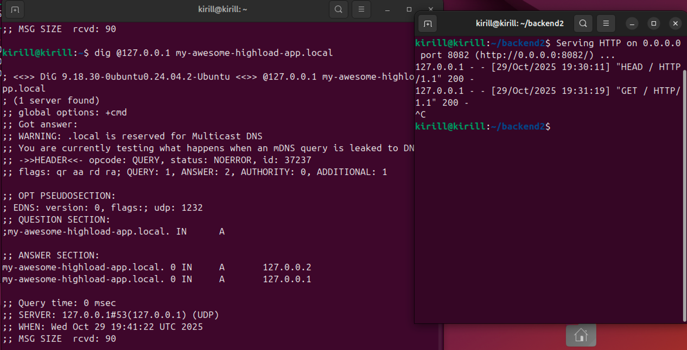

Соответственно если backend2 (127.0.0.2) сломается - DNS будет продолжать отдавать оба IP, т.к. dnsmasq не отслеживает
работоспособность бэкендов - балансировка на DNS уровне не учитывает состояние серверов.

### Задание 3
- ___Создайте dummy1 интерфейс с адресом 192.168.100.1/32___

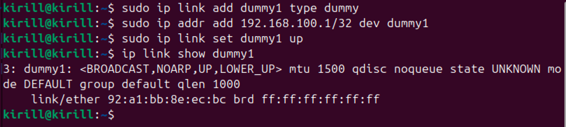

- ___Используя ipvsadm создайте VS для TCP порта 80 ведущего в 127.0.0.1:8081 и 127.0.0.1:8082 использующего round-robin 
тип балансировки___

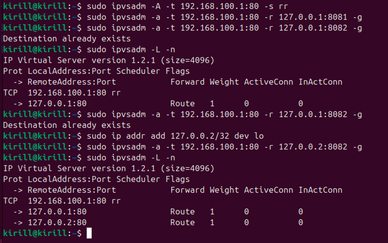

При попытке вторую запись с портом 8082 - вылетала ошибка "Destination already exists".
Как я понял, это происходило из-за того, что несмотря на разные порты - ошибка возникала из-за того, что был одинаковый 
IP.
Соответственно необходимо было предварительно добавить ``127.0.0.2`` к loopback-интерфейсу

Серверы backend также остаются доступными

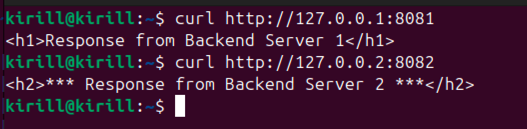

- ___Используя curl сходите в http://192.168.100.1 продемонстрируйте счетчики на ipvs, убедитесь, что балансировка 
происходит___

Я прокинул 7 запросов, после чего проверил

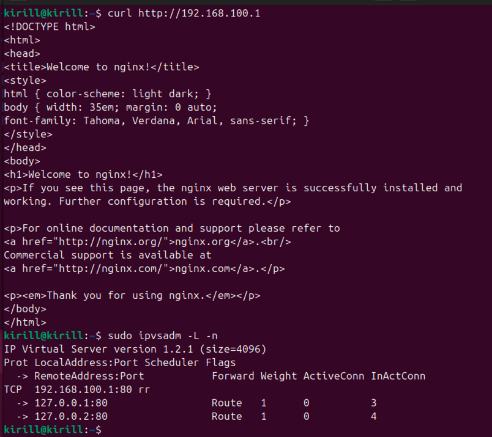

Можно увидеть, что балансировка происходит, на однин сервер было направлено 3 запроса, на другой 4

### Задание 4
- ___Создайте пул из 127.0.0.1:8081 и 127.0.0.1:8082 в nginx с active-backup балансировкой___

Для этого создал конфиг в ``/etc/nginx/conf.d/highload.conf``

```
upstream backend {
  server 127.0.0.1:8081 max_fails=7 fail_timeout=20s;
  server 127.0.0.1:8082 backup;
}

server {
  listen 127.0.0.1:8888;

        location / {
                proxy_pass http://backend;
                proxy_set_header X-high-load-test 123;
                proxy_connect_timeout 1s;
                proxy_read_timeout 1s;
                proxy_next_upstream off;
        }
}
```

- ___Убедитесь, что переключение на backup сервер происходит после 7 неудачных попыток сходить в активный сервер___

Отправим запрос, убедимся, что backend1 работает

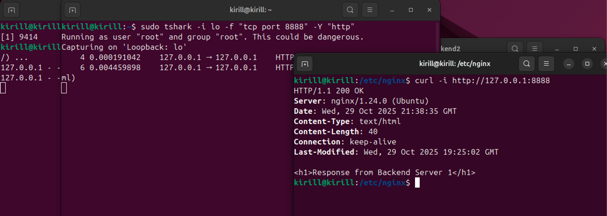

После этого отключим backend1

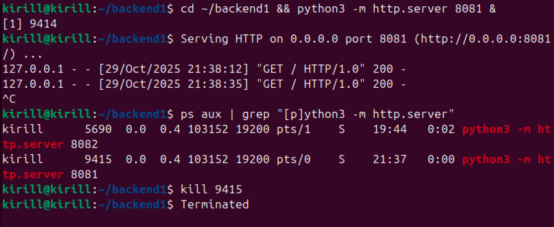

И попробуем послать на него 10 запросов

```
kirill@kirill:/etc/nginx$ curl -i http://127.0.0.1:8888
HTTP/1.1 200 OK
Server: nginx/1.24.0 (Ubuntu)
Date: Wed, 29 Oct 2025 22:14:31 GMT
Content-Type: text/html
Content-Length: 40
Connection: keep-alive
Last-Modified: Wed, 29 Oct 2025 19:25:02 GMT

<h1>Response from Backend Server 1</h1>
kirill@kirill:/etc/nginx$ for i in {1..10}; do   curl -s -w "%{http_code}\n" http://127.0.0.1:8888; sleep 1; done
<html>
<head><title>502 Bad Gateway</title></head>
<body>
<center><h1>502 Bad Gateway</h1></center>
<hr><center>nginx/1.24.0 (Ubuntu)</center>
</body>
</html>
502
<html>
<head><title>502 Bad Gateway</title></head>
<body>
<center><h1>502 Bad Gateway</h1></center>
<hr><center>nginx/1.24.0 (Ubuntu)</center>
</body>
</html>
502
<html>
<head><title>502 Bad Gateway</title></head>
<body>
<center><h1>502 Bad Gateway</h1></center>
<hr><center>nginx/1.24.0 (Ubuntu)</center>
</body>
</html>
502
<html>
<head><title>502 Bad Gateway</title></head>
<body>
<center><h1>502 Bad Gateway</h1></center>
<hr><center>nginx/1.24.0 (Ubuntu)</center>
</body>
</html>
502
<html>
<head><title>502 Bad Gateway</title></head>
<body>
<center><h1>502 Bad Gateway</h1></center>
<hr><center>nginx/1.24.0 (Ubuntu)</center>
</body>
</html>
502
<html>
<head><title>502 Bad Gateway</title></head>
<body>
<center><h1>502 Bad Gateway</h1></center>
<hr><center>nginx/1.24.0 (Ubuntu)</center>
</body>
</html>
502
<html>
<head><title>502 Bad Gateway</title></head>
<body>
<center><h1>502 Bad Gateway</h1></center>
<hr><center>nginx/1.24.0 (Ubuntu)</center>
</body>
</html>
502
<h2>*** Response from Backend Server 2 ***</h2>
200
<h2>*** Response from Backend Server 2 ***</h2>
200
<h2>*** Response from Backend Server 2 ***</h2>
200
```

Запрос и ответ в tshark:

```
kirill@kirill:~$ sudo tshark -i any -f "tcp port 8081 or tcp port 8082 or tcp port 8888" -Y "http.request or http.response" -O http
Running as user "root" and group "root". This could be dangerous.
Capturing on 'any'
Frame 4: 145 bytes on wire (1160 bits), 145 bytes captured (1160 bits) on interface any, id 0
Linux cooked capture v1
Internet Protocol Version 4, Src: 127.0.0.1, Dst: 127.0.0.1
Transmission Control Protocol, Src Port: 52550, Dst Port: 8888, Seq: 1, Ack: 1, Len: 77
Hypertext Transfer Protocol
    GET / HTTP/1.1\r\n
        [Expert Info (Chat/Sequence): GET / HTTP/1.1\r\n]
            [GET / HTTP/1.1\r\n]
            [Severity level: Chat]
            [Group: Sequence]
        Request Method: GET
        Request URI: /
        Request Version: HTTP/1.1
    Host: 127.0.0.1:8888\r\n
    User-Agent: curl/8.5.0\r\n
    Accept: */*\r\n
    \r\n
    [Full request URI: http://127.0.0.1:8888/]
    [HTTP request 1/1]

Frame 9: 180 bytes on wire (1440 bits), 180 bytes captured (1440 bits) on interface any, id 0
Linux cooked capture v1
Internet Protocol Version 4, Src: 127.0.0.1, Dst: 127.0.0.1
Transmission Control Protocol, Src Port: 35440, Dst Port: 8081, Seq: 1, Ack: 1, Len: 112
Hypertext Transfer Protocol
    GET / HTTP/1.0\r\n
        [Expert Info (Chat/Sequence): GET / HTTP/1.0\r\n]
            [GET / HTTP/1.0\r\n]
            [Severity level: Chat]
            [Group: Sequence]
        Request Method: GET
        Request URI: /
        Request Version: HTTP/1.0
    X-high-load-test: 123\r\n
    Host: backend\r\n
    Connection: close\r\n
    User-Agent: curl/8.5.0\r\n
    Accept: */*\r\n
    \r\n
    [Full request URI: http://backend/]
    [HTTP request 1/1]

Frame 13: 108 bytes on wire (864 bits), 108 bytes captured (864 bits) on interface any, id 0
Linux cooked capture v1
Internet Protocol Version 4, Src: 127.0.0.1, Dst: 127.0.0.1
Transmission Control Protocol, Src Port: 8081, Dst Port: 35440, Seq: 186, Ack: 113, Len: 40
[2 Reassembled TCP Segments (225 bytes): #11(185), #13(40)]
Hypertext Transfer Protocol
    HTTP/1.0 200 OK\r\n
        [Expert Info (Chat/Sequence): HTTP/1.0 200 OK\r\n]
            [HTTP/1.0 200 OK\r\n]
            [Severity level: Chat]
            [Group: Sequence]
        Response Version: HTTP/1.0
        Status Code: 200
        [Status Code Description: OK]
        Response Phrase: OK
    Server: SimpleHTTP/0.6 Python/3.12.3\r\n
    Date: Wed, 29 Oct 2025 22:14:31 GMT\r\n
    Content-type: text/html\r\n
    Content-Length: 40\r\n
        [Content length: 40]
    Last-Modified: Wed, 29 Oct 2025 19:25:02 GMT\r\n
    \r\n
    [HTTP response 1/1]
    [Time since request: 0.005011143 seconds]
    [Request in frame: 9]
    [Request URI: http://backend/]
    File Data: 40 bytes
Line-based text data: text/html (1 lines)

Frame 19: 310 bytes on wire (2480 bits), 310 bytes captured (2480 bits) on interface any, id 0
Linux cooked capture v1
Internet Protocol Version 4, Src: 127.0.0.1, Dst: 127.0.0.1
Transmission Control Protocol, Src Port: 8888, Dst Port: 52550, Seq: 1, Ack: 78, Len: 242
Hypertext Transfer Protocol
    HTTP/1.1 200 OK\r\n
        [Expert Info (Chat/Sequence): HTTP/1.1 200 OK\r\n]
            [HTTP/1.1 200 OK\r\n]
            [Severity level: Chat]
            [Group: Sequence]
        Response Version: HTTP/1.1
        Status Code: 200
        [Status Code Description: OK]
        Response Phrase: OK
    Server: nginx/1.24.0 (Ubuntu)\r\n
    Date: Wed, 29 Oct 2025 22:14:31 GMT\r\n
    Content-Type: text/html\r\n
    Content-Length: 40\r\n
        [Content length: 40]
    Connection: keep-alive\r\n
    Last-Modified: Wed, 29 Oct 2025 19:25:02 GMT\r\n
    \r\n
    [HTTP response 1/1]
    [Time since request: 0.005415853 seconds]
    [Request in frame: 4]
    [Request URI: http://127.0.0.1:8888/]
    File Data: 40 bytes
Line-based text data: text/html (1 lines)
```

Наблюдаем за портами 8081, 8082 и 8888. 8888 получает запрос, проксирует его на 8081 и добавляет заданный header.

Далее ответ с порта 8081 на 8888 и возвращение ответа.
